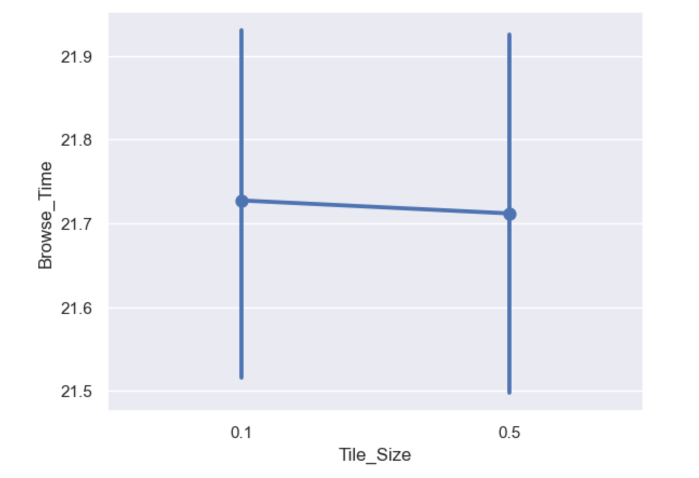
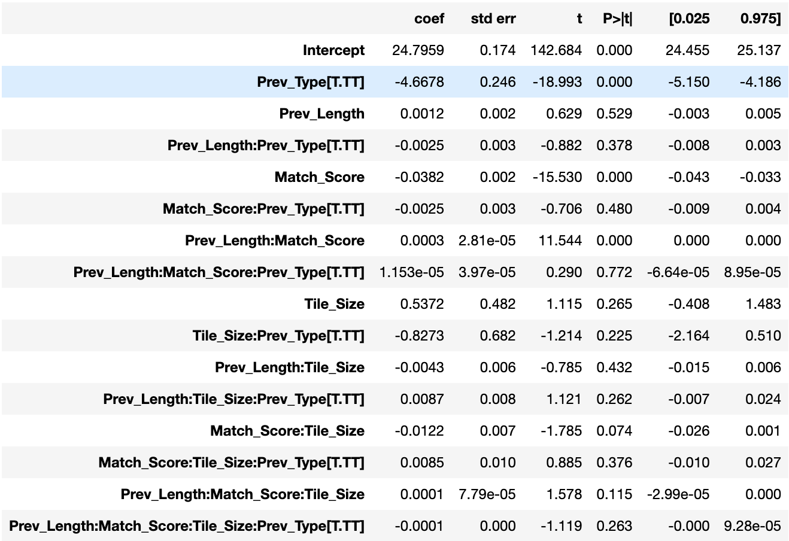

# Netflix Homepage Optimization Project

## Executive Summary

The aim of this project was to optimize Netflix homepage browsing time by experimenting with four key factors: Tile Size, Match Score, Preview Length, and Preview Type. Through a series of multivariate experiments, we identified the optimal configuration: [0.2, 75, 75, TT] for [Tile.Size, Match.Score, Prev.Length, Prev.Type]. These insights provide Netflix with valuable information on enhancing user experience and minimizing average browsing time.

## Introduction

Inspired by Netflix's data-driven approach, this project addresses the challenge of minimizing browsing time on the homepage. Decision paralysis due to abundant choices often leads to increased browsing time and decreased content consumption. We explored four factors: tile size (0.1-0.5), match score (0-100), preview length (30-120 seconds), and preview type (actual content (AC) or teaser/trailer (TT)).

We employed a series of multivariate experiments, starting with a 2^4 factorial test comprising 16 conditions, followed by two Central Composite Design (CCD) Response Surface Methodology (RSM) tests, each with 9 conditions. Finally, we conducted a targeted search around the calculated optimum using 6 additional experimental conditions.

## The Experiments

### Factorial Experiment
Objective: Assess how factors like Preview Type, Tile Size, Prev Length, and Match Score affect Browse Time and determine their significance and interactions.

Plan: Conduct a 2^4 factorial test using binary values for continuous factors, resulting in 16 experimental designs. An OLS model evaluated the significance of each factor’s main effect and the interaction effect between factors.

Analysis: The OLS model showed that Tile Size was not significant, while the Prev Type (TT) had a negative coefficient of -4.67, indicating lower browse times. All main effects (besides Tile Size) were significant, with a significant interaction between Preview Length and Match Score.

Conclusion: Tile Size is insignificant. TT previews should minimize browse times. Future focus will be on investigating changes in Preview Length and Match Score.

<table>
  <tr>
    <td></td>
    <td></td>
  </tr>
  <tr>
    <td></td>
    <td></td>
  </tr>
  <tr>
    <td></td>
    <td></td>
  </tr>
</table>

### CCD Trial-I
Objective: Narrow down the search area and find the slope leading to the optimum.

Plan: In this trial we expanded our experimental design to include two Central Composite Design (CCD) Response Surface Methodology (RSM) tests with 9 conditions each. The plan was to vary only two factors, Preview Length and Match Score, allowing us to perform a CCD of 3^2 factorial design. The factors and levels tested were Preview Type (TT), Tile Size (0.2) Preview Length (high: 100, low: 50, mean: 75, a value: ±1.4), and Match Score (high: 75, low: 25, mean: 50, a value: ± 1.4). In this case, the “a” value of 1.4 refers to coded units of the form square root of K’. In our case K’=2 and can be simplified to 1.4 which translates to a magnitude of 35 in natural units.

Analysis: Our regression model with an R-squared of 0.841 highlights a significant inverse relationship between Browse Time and both Preview Length and Match Score, indicating that browse time decreases as these factors increase, up to a point. The model's positive coefficients for the interaction and quadratic terms suggest a nonlinear relationship. The contour plot visualizes this relationship, showing a theoretical minimum at the stationary point, calculated using formula: Xs =  -1/2B^-1*b. This point was found to be at (66, 72) for Preview Length and Match Score. 

</td>

Conclusion: Browse Time seems minimized as Preview Length and Match Score move towards (66, 72). Further experiments around this point are necessary to ensure it's not a local minimum. As such, additional experiments targeted closer to the stationary should be run, but not so targeted such that other potential optimum points would be missed. Running trials near the high and low values for Preview Length and Match Score could be discounted as they gave us poor results (longer browse times). 

### CCD Trial-II
Objective: Get closer to the true optimum.

Plan: Another 3^2 factorial design (9 conditions) testing Preview Length and Match Score with values adjusted slightly from the traditional CCD design. The factors and levels tested were Preview Type (TT), Tile Size (0.2) Preview Length (high: 70, low: 60, mean: 65, a value: ±1.4), and Match Score (high: 100, low: 70, mean: 85, a value: -1.4). For match score we deviated slightly from the traditional CCD design by using another value at 95 instead of at a coded value of 1.4 since 100 is the max Match Score. We set 100 as our high as we had a suspicion that higher match scores may result in lower browse times.

Analysis: Similar results to the first CCD test, with the theoretical optimum still at (66, 72). The main effect plot suggested a better local minimum around 75 for Preview Length and 70 for Match Score.

</td>
</td>
</td>

Conclusion: Browse Time was not optimized with increasing Match Score. Focus on the calculated theoretical minimum of (66, 72) and explore a preview length of 75.

### Final Trial
Objective: Zero in on the optimal configuration.

Plan: Test three different Preview Lengths (70, 75, 80) with two Match Scores (75, 80). Also, test 65 Preview Length with 72 Match Score.

Analysis: Main effect plots indicated 75 for both Match Score and Preview Length led to the lowest browsing time (~10.11 minutes).

<table>
  <tr>
    <td></td>
    <td></td>
  </tr>
  <tr>
    <td></td>
    <td></td>
  </tr>
</table>

Conclusion: The optimum configuration is [0.2, 75, 75, TT].
